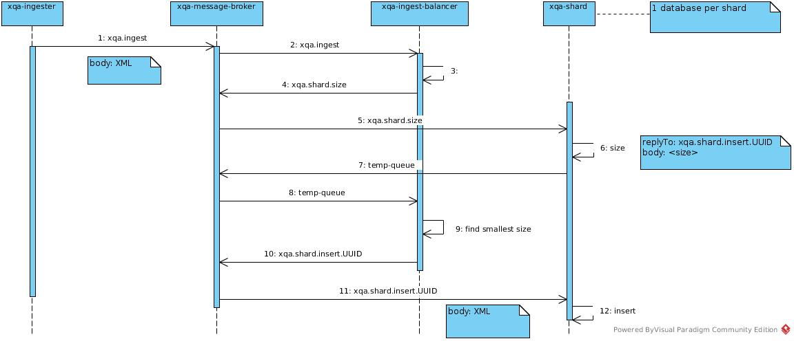

# xqa-shard  
* an embedded in-memory BaseX instance with a AMQP interface.

* See .travis.yml for py.test example, including flake8 and coverage arguments.

## 1. High Level Design

## 2. Docker
### 2.1. Build locally
* docker-compose -p "dev" build --rm

### 2.2. Bring up
* docker-compose -p "dev" up -d  # single instance

or

* docker-compose -p "dev" up -d --scale xqa-shard=2  # two instances

### 2.3 Stop
* docker-compose stop

### 2.4. Teardown
* docker-compose -p "dev" down --rmi all -v

## 3. Debug inserts into /tmp
$ XQA_WRITE_FILE=1 python src/xqa/shard.py
